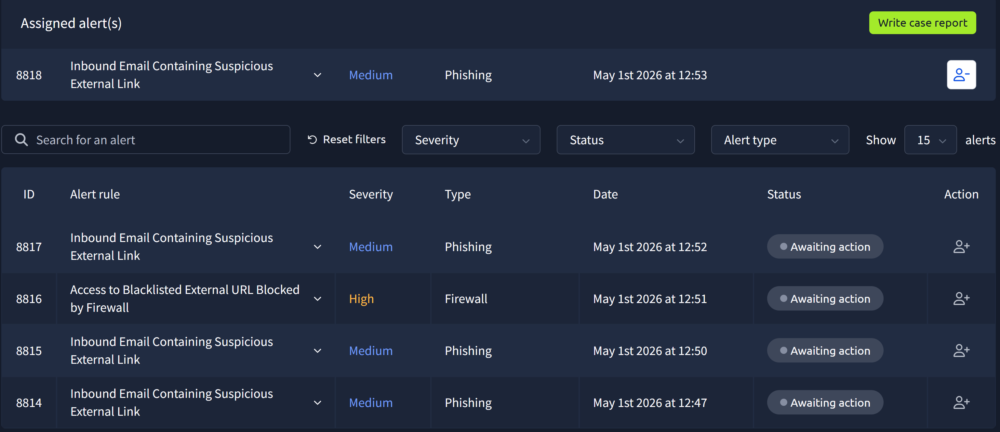
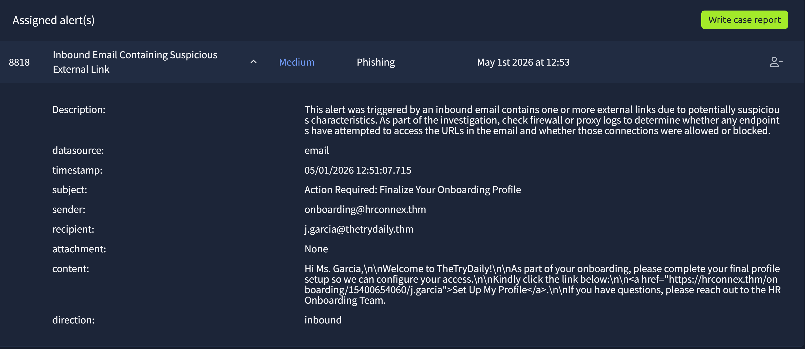
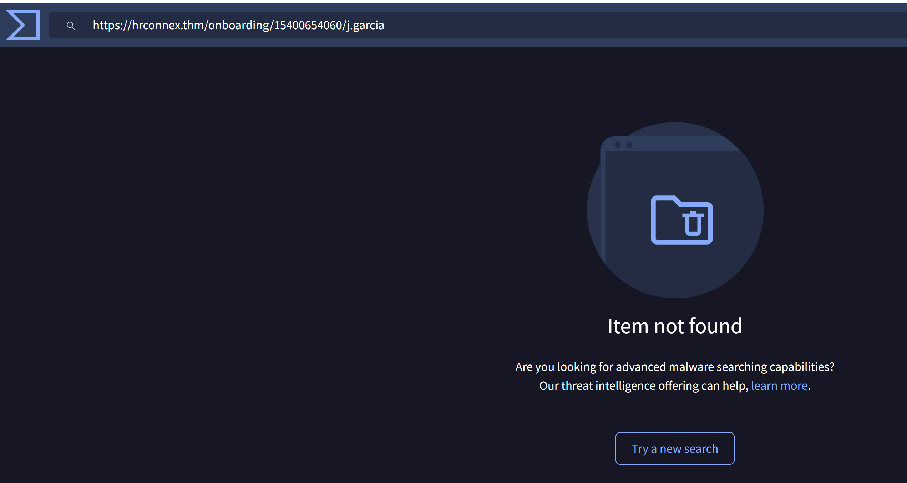
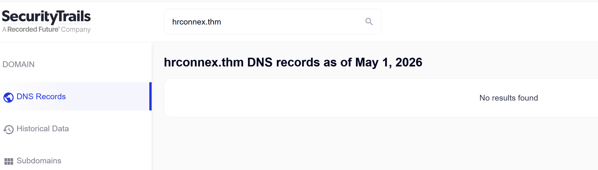
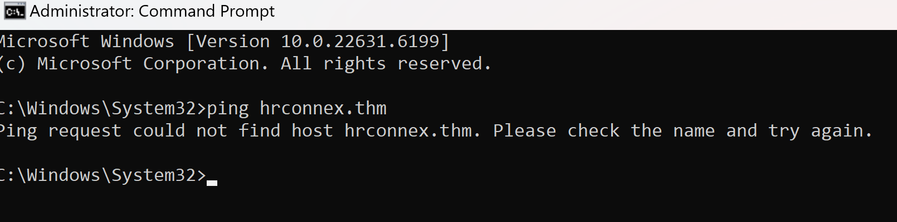
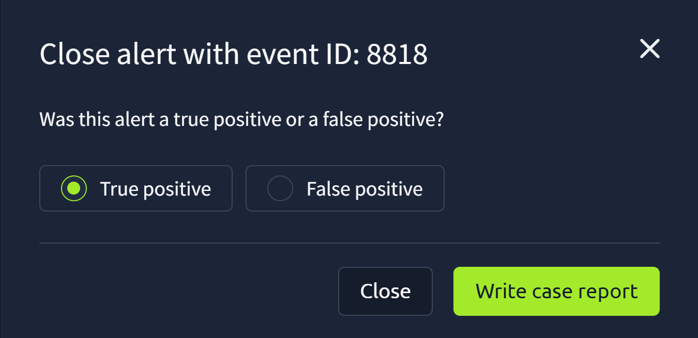
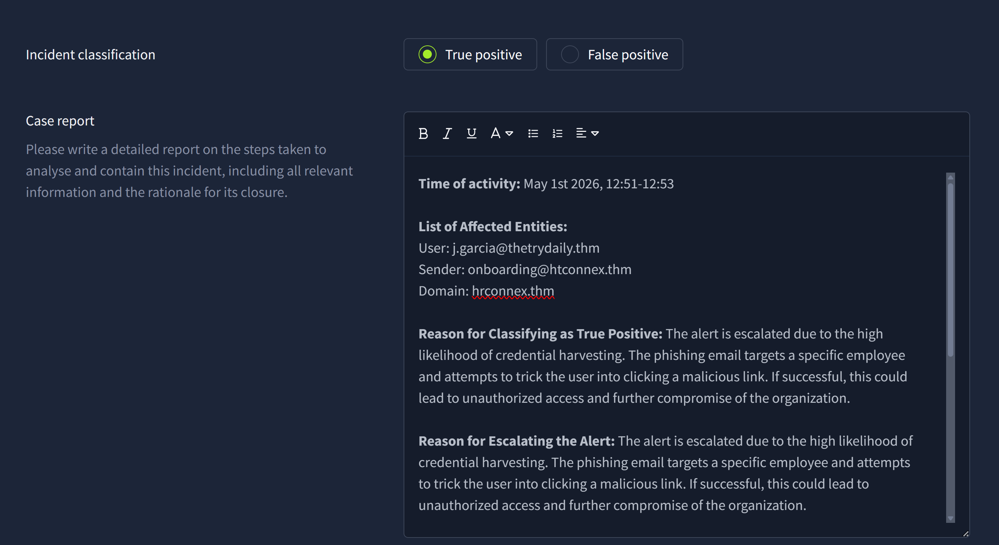
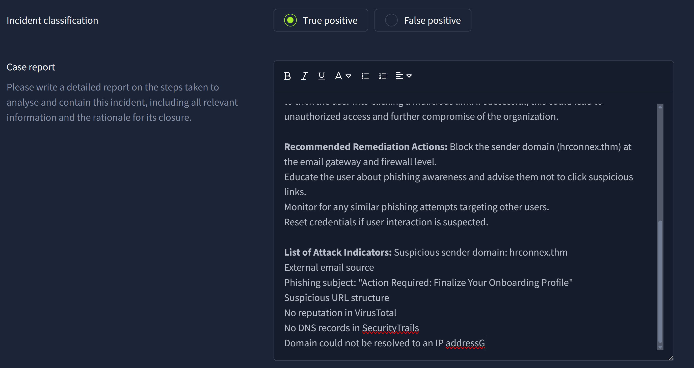
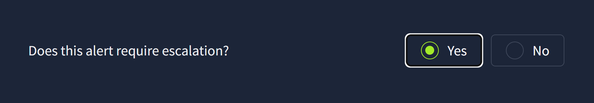

# Lab 01 – Phishing Email Investigation (TryHackMe)

## Scenario Overview

This lab documents a phishing investigation performed in the TryHackMe SOC Simulator. The alert involved an inbound email containing a suspicious external link.

The objective was to review the alert, analyze the email and URL indicators, classify the alert, document the case report, and close the alert correctly.

---

## Time of Activity

May 1st 2026, 12:51 – 12:53

---

## Affected Entities

- Recipient: `j.garcia@thetrydaily.thm`
- Sender: `onboarding@hrconnex.thm`
- Suspicious domain: `hrconnex.thm`
- Suspicious URL: `https://hrconnex.thm/onboarding/15400654060/j.garcia`

---

## 1. Alert Queue Review

The investigation started from the alert queue. Event ID `8818` was selected because it was categorized as a phishing alert and involved an inbound email containing a suspicious external link.

**What this shows:**  
The SOC simulator shows multiple open alerts. Alert ID `8818` was selected for investigation because it matched a phishing scenario involving an external link.

---

## 2. Alert Details and Email Metadata

The alert details were reviewed to understand the sender, recipient, subject, direction, and email content.

**What this shows:**  
The email was inbound and sent from `onboarding@hrconnex.thm` to `j.garcia@thetrydaily.thm`. The subject line was `Action Required: Finalize Your Onboarding Profile`, which creates urgency and uses an onboarding scenario to encourage user interaction.

---

## 3. Full URL Reputation Check – VirusTotal

The full URL extracted from the email was checked in VirusTotal.

Analyzed URL: `https://hrconnex.thm/onboarding/15400654060/j.garcia`

**What this shows:**  
VirusTotal returned `Item not found`, meaning the full URL had no known reputation. This does not prove the URL is safe. In phishing investigations, a lack of reputation can increase suspicion because newly created or rarely used URLs are often used in phishing campaigns.

---

## 4. Domain DNS Check – SecurityTrails

The base domain `hrconnex.thm` was checked in SecurityTrails to verify whether DNS records existed.

**What this shows:**  
SecurityTrails returned no DNS records for `hrconnex.thm`. This supports the finding that the domain could not be verified as a legitimate or established domain.

---

## 5. Local DNS Resolution Test

A local DNS resolution test was performed using the `ping` command.

**What this shows:**  
The domain `hrconnex.thm` could not be resolved to an IP address. This confirms that the domain was not publicly resolvable during the investigation.

---

## 6. True Positive Classification

After reviewing the email content, the suspicious URL, the lack of reputation in VirusTotal, missing DNS records in SecurityTrails, and failed local DNS resolution, the alert was classified as a True Positive.

**What this shows:**  
The alert was marked as `True Positive`, meaning the investigation supported that this was a valid phishing attempt rather than a false positive.

---

## 7. Case Report Documentation – Part 1

The first part of the case report documents the time of activity, affected entities, classification reason, and escalation reason.

**What this shows:**  
The report includes the affected user, sender, domain, and the reason for classifying the alert as a True Positive phishing attempt.

---

## 8. Case Report Documentation – Part 2

The second part of the case report documents remediation actions and attack indicators.

**What this shows:**  
The report includes recommended remediation actions such as blocking the sender domain, educating the user, monitoring for similar phishing attempts, and resetting credentials if user interaction is suspected.

---

## 9. Escalation Decision

The alert was escalated due to the risk of credential harvesting and possible unauthorized access if the user interacted with the phishing link.

**What this shows:**  
The alert was marked for escalation because phishing emails can lead to credential compromise and further compromise of the organization.

---

## 10. Alert Closure Confirmation

After the investigation and case report were completed, the alert was submitted and closed.

**What this shows:**  
The platform confirmed that the alert was successfully closed after being investigated, documented, classified, and escalated.

---

## Indicators of Compromise (IOCs)

| Type | Indicator |
|---|---|
| Sender email | `onboarding@hrconnex.thm` |
| Recipient | `j.garcia@thetrydaily.thm` |
| Domain | `hrconnex.thm` |
| URL | `https://hrconnex.thm/onboarding/15400654060/j.garcia` |
| Subject | `Action Required: Finalize Your Onboarding Profile` |

---

## Why This Was Classified as Phishing

The alert was classified as phishing because several suspicious indicators appeared together:

- The email used an onboarding theme to gain trust.
- The subject created urgency with `Action Required`.
- The email contained an external link requiring user interaction.
- The full URL had no reputation in VirusTotal.
- The domain had no DNS records in SecurityTrails.
- The domain could not be resolved locally using DNS.

No single indicator alone proves phishing with absolute certainty. However, the combination of these indicators strongly supports a True Positive phishing classification.

---

## Final Classification

**True Positive – Phishing**

---

## Recommended Remediation Actions

- Block the sender/domain at the email gateway.
- Monitor for similar emails targeting other users.
- Educate the affected user about phishing indicators.
- Reset credentials if the user clicked the link or submitted information.
- Review email security logs for related activity.

---

## Skills Demonstrated

- SOC alert triage
- Email metadata review
- Phishing analysis
- URL reputation checking
- DNS and domain investigation
- Threat intelligence usage
- Case report writing
- Incident classification
