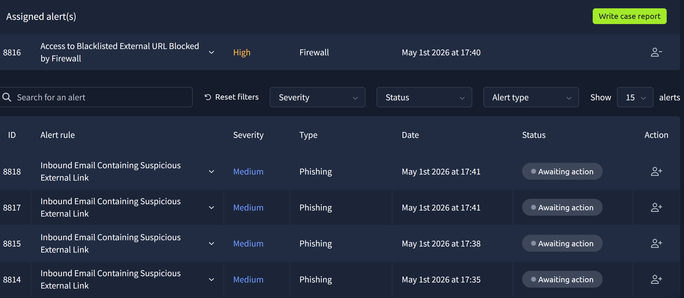
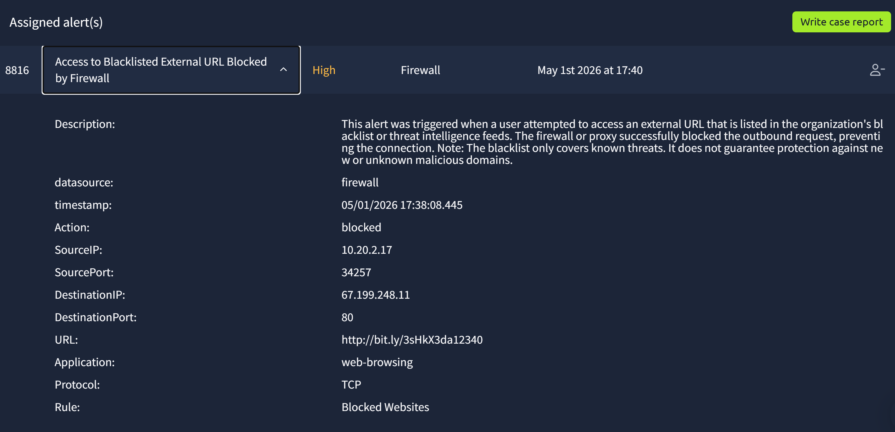
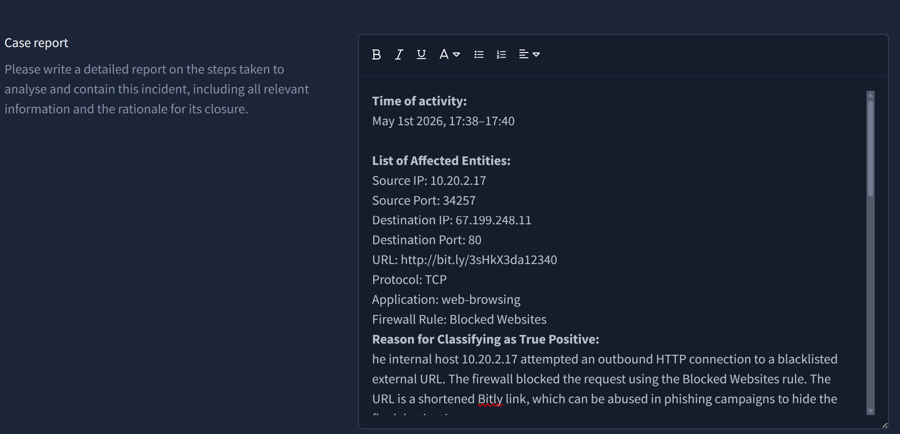
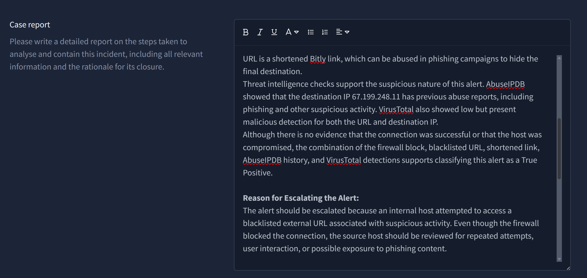
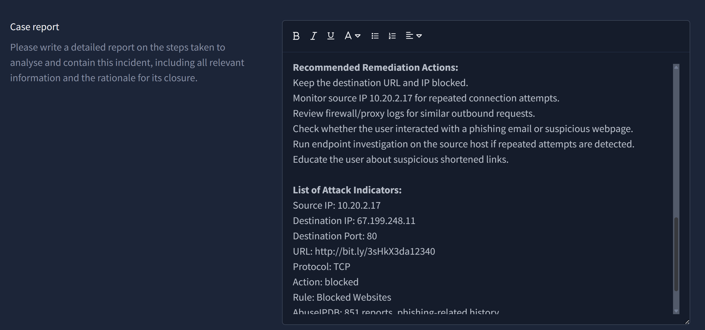
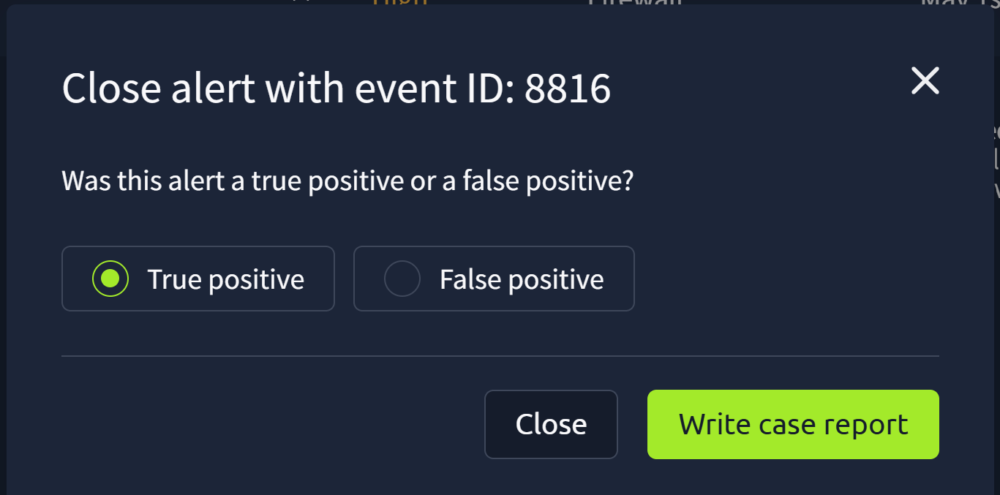
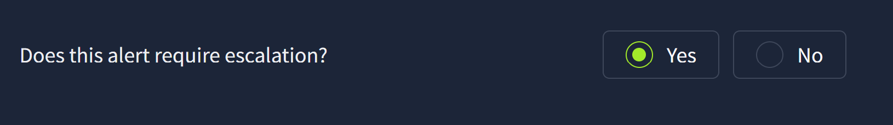
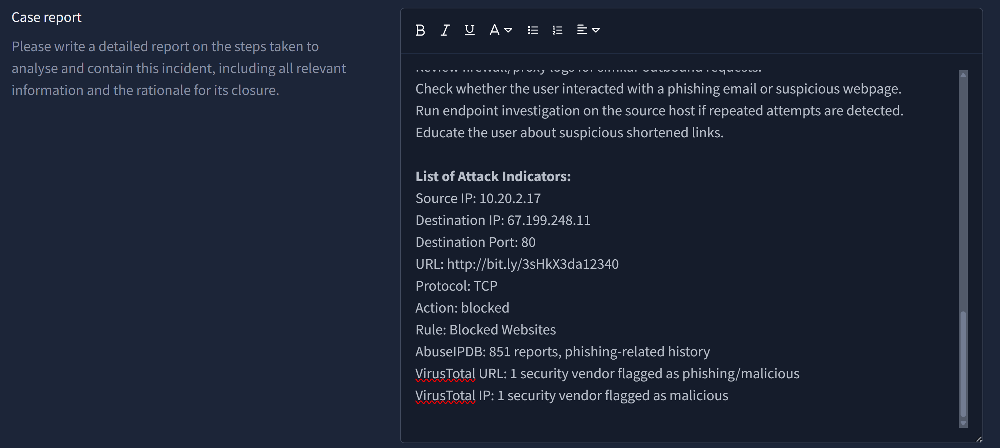
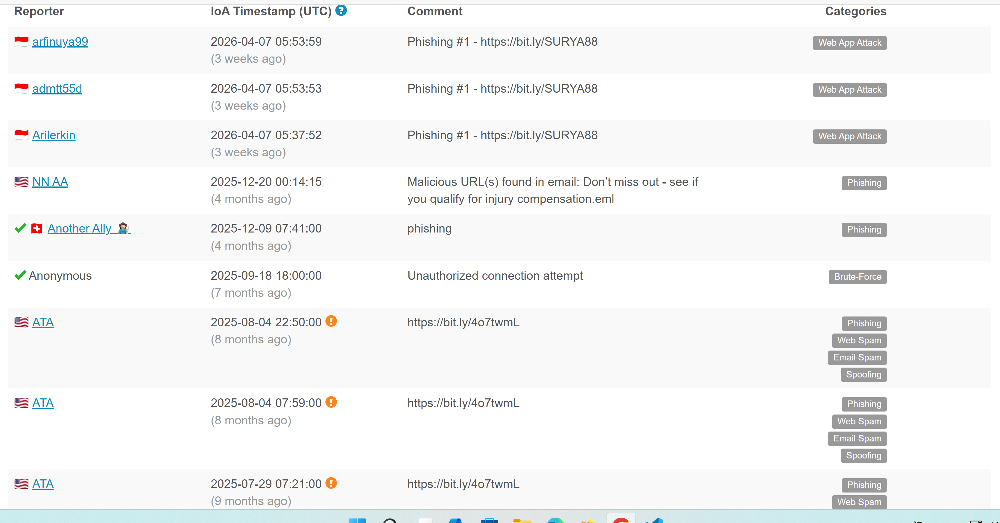

# Lab 02 – Firewall Blocked Blacklisted URL Investigation (TryHackMe)

## Scenario Overview

This lab documents a firewall alert investigation performed in the TryHackMe SOC Simulator.

The alert was triggered when an internal host attempted an outbound connection to a blacklisted external URL. The firewall successfully blocked the request. The objective of this investigation was to review the firewall event, analyze the network indicators, enrich the destination IP and URL using AbuseIPDB and VirusTotal, classify the alert, and document the response.

---

## Time of Activity

May 1st 2026, 17:38 – 17:40

---

## Alert Summary

| Field | Value |
|---|---|
| Event ID | `8816` |
| Alert Rule | `Access to Blacklisted External URL Blocked by Firewall` |
| Severity | `High` |
| Alert Type | `Firewall` |
| Datasource | `firewall` |
| Action | `blocked` |
| Firewall Rule | `Blocked Websites` |

---

## Network Indicators

| Field | Value |
|---|---|
| Source IP | `10.20.2.17` |
| Source Port | `34257` |
| Destination IP | `67.199.248.11` |
| Destination Port | `80` |
| URL | `http://bit.ly/3sHkX3da12340` |
| Application | `web-browsing` |
| Protocol | `TCP` |
| Action | `blocked` |
| Rule | `Blocked Websites` |

---

## 1. Alert Queue Review

The investigation started from the alert queue. Event ID `8816` was selected because it was a High severity firewall alert involving access to a blacklisted external URL.

**What this shows:**  
The SOC simulator shows a High severity firewall alert. The alert indicates that an internal user or host attempted to access an external URL listed in the organization's blacklist or threat intelligence feeds.

---

## 2. Firewall Alert Details

The alert details were reviewed to identify the source, destination, URL, protocol, firewall action, and triggered firewall rule.

**What this shows:**  
The internal host `10.20.2.17` attempted an outbound TCP connection to destination IP `67.199.248.11` over destination port `80`. The requested URL was `http://bit.ly/3sHkX3da12340`. The firewall action was `blocked`, and the triggered rule was `Blocked Websites`.

**Analysis:**  
This was an outbound web-browsing attempt from an internal host to an external destination. Destination port `80` indicates HTTP traffic. The URL is a Bitly shortened link, which is suspicious because URL shorteners can hide the final destination and are often abused in phishing campaigns.

At this point, the alert should not be treated as proof that the internal host is compromised. The correct interpretation is that an internal host attempted to access a blacklisted external URL and the firewall successfully blocked the connection.

---

## 3. AbuseIPDB – Destination IP Overview

The destination IP address `67.199.248.11` was checked in AbuseIPDB.

**What this shows:**  
AbuseIPDB shows that `67.199.248.11` exists in its database and has been reported `851` times. The Abuse Confidence Score is `13%`. The IP is associated with Bitly infrastructure, and the hostname/domain shown is `bit.ly`.

**Analysis:**  
A `13%` Abuse Confidence Score is not strong standalone proof that the IP address is malicious. However, the number of historical reports is relevant. Since this IP belongs to Bitly infrastructure, it should be interpreted carefully: Bitly is a legitimate URL-shortening service, but attackers often abuse URL shorteners to hide phishing or malicious destinations.

In this investigation, AbuseIPDB supports the suspicious nature of the destination, but it should be used as supporting evidence rather than the only basis for classification.

---

## 4. AbuseIPDB – Abuse Report History

The AbuseIPDB report history was reviewed to understand what types of suspicious activity were previously associated with the destination IP.

**What this shows:**  
The IP has previous reports related to phishing, web attacks, web spam, email spam, spoofing, and unauthorized connection attempts.

**Analysis:**  
The report history shows repeated suspicious activity associated with this infrastructure. Because the IP is related to Bitly, the IP itself should not automatically be treated as fully malicious. However, the presence of phishing-related reports increases the confidence that this specific blocked request was suspicious.

---

## 5. VirusTotal – Destination IP Check

The destination IP address `67.199.248.11` was checked in VirusTotal.

**What this shows:**  
VirusTotal shows that `1/91` security vendors flagged the destination IP address as malicious.

**Analysis:**  
This is a low detection ratio, so it should not be treated as absolute proof that the IP address is malicious. However, it is a supporting indicator when combined with the firewall block, the blacklisted URL, AbuseIPDB history, and the shortened URL structure.

---

## 6. VirusTotal – Shortened URL Check

The shortened URL `http://bit.ly/3sHkX3da12340` was checked in VirusTotal.

**What this shows:**  
VirusTotal shows that `1/92` security vendors flagged the URL as malicious/phishing. The URL also shows redirect-related behavior such as `meta-redirect` and `multiple-redirects`.

**Analysis:**  
This result is especially relevant because the firewall alert was triggered by access to this specific URL. Even though only one vendor flagged it, the phishing classification supports the suspicious nature of the blocked request. The redirect behavior is also important because shortened links can hide the final destination from the user.

---

## 7. Classification Decision

After reviewing the firewall event and threat intelligence results, the alert was classified as a True Positive.

**What this shows:**  
The alert was marked as `True Positive`.

**Analysis:**  
This is not a false positive because the firewall actually blocked an outbound request to a blacklisted external URL. The classification does not prove that the internal host is compromised, but it confirms that the alert represents a real suspicious outbound connection attempt.

---

## 8. Case Report – Affected Entities and Initial Reasoning

The first part of the case report documents the time of activity, affected entities, and the initial classification reasoning.

**What this shows:**  
The report documents the source IP, source port, destination IP, destination port, URL, protocol, application, and firewall rule involved in the event.

**Analysis:**  
The key affected internal entity is `10.20.2.17`. This host attempted to access the blacklisted shortened URL. Since the firewall action was `blocked`, there is no evidence from this alert alone that the connection was successful.

---

## 9. Case Report – Classification and Escalation Reason

The second part of the case report explains why the alert was treated as a True Positive and why escalation was required.

**What this shows:**  
The report explains that the internal host attempted an outbound HTTP connection to a blacklisted external URL, and that threat intelligence checks supported the suspicious nature of the event.

**Analysis:**  
The alert requires escalation because an internal host attempted to access a URL associated with suspicious activity. Even though the firewall blocked the connection, the source host should be reviewed for repeated attempts, user interaction, or possible exposure to phishing content.

---

## 10. Case Report – Recommended Remediation Actions

The third part of the case report documents recommended remediation actions.

**What this shows:**  
The report recommends keeping the destination URL and IP blocked, monitoring the source IP for repeated attempts, reviewing firewall or proxy logs, checking possible user interaction, and performing endpoint investigation if repeated attempts are detected.

**Analysis:**  
The response should not stop only at blocking the destination. The internal host should also be monitored because repeated connection attempts could indicate user interaction with phishing content, browser redirection, or suspicious endpoint behavior.

---

## 11. Case Report – Attack Indicators

The final part of the case report lists the attack indicators used during the investigation.

**What this shows:**  
The report lists the key indicators: source IP, destination IP, destination port, URL, protocol, firewall action, firewall rule, AbuseIPDB reports, and VirusTotal detections.

**Analysis:**  
These indicators summarize the technical evidence that supported the True Positive classification. They can also be used for further monitoring, hunting, or correlation with other firewall/proxy events.

---

## 12. Escalation Decision

The alert was escalated due to the potential risk of phishing exposure, repeated outbound attempts, or further suspicious activity from the internal host.

**What this shows:**  
The alert was marked for escalation.

**Analysis:**  
Escalation is appropriate because the alert is High severity and involves an internal host attempting to access a blacklisted external URL. Escalation means that additional monitoring or review is required. It does not automatically mean that the host is confirmed compromised.

---

## 13. Alert Closure

After classification, documentation, and escalation, the alert was successfully closed.

**What this shows:**  
The alert was closed after being investigated, documented, classified as True Positive, and escalated.

---

## Investigation Summary

The firewall blocked an outbound HTTP request from internal host `10.20.2.17` to the shortened URL `http://bit.ly/3sHkX3da12340`. The destination IP was `67.199.248.11` over TCP port `80`.

The URL is a Bitly shortened link. Bitly is a legitimate service, but shortened URLs are commonly abused in phishing campaigns because they hide the final destination from the user.

Threat intelligence checks provided supporting evidence:

- AbuseIPDB shows historical abuse reports for `67.199.248.11`.
- AbuseIPDB reports include phishing and other suspicious categories.
- VirusTotal shows low but present malicious detection for the destination IP.
- VirusTotal shows low but present phishing/malicious detection for the shortened URL.
- The firewall rule `Blocked Websites` successfully blocked the request.

There is no evidence from this alert alone that the connection succeeded or that the internal host was compromised. However, the combination of firewall blocking, blacklisted URL, shortened URL structure, AbuseIPDB history, and VirusTotal detections supports a True Positive classification.

---

## Indicators of Compromise

| Type | Indicator |
|---|---|
| Source IP | `10.20.2.17` |
| Source Port | `34257` |
| Destination IP | `67.199.248.11` |
| Destination Port | `80` |
| URL | `http://bit.ly/3sHkX3da12340` |
| Protocol | `TCP` |
| Application | `web-browsing` |
| Firewall Action | `blocked` |
| Firewall Rule | `Blocked Websites` |
| AbuseIPDB | `851 reports`, `13% Abuse Confidence Score` |
| VirusTotal IP | `1/91 vendor flagged as malicious` |
| VirusTotal URL | `1/92 vendor flagged as malicious/phishing` |

---

## Final Classification

**True Positive – Blocked outbound access to a blacklisted external URL**

---

## Recommended Remediation Actions

- Keep the destination URL blocked.
- Keep the destination IP blocked if aligned with organizational policy.
- Monitor source IP `10.20.2.17` for repeated connection attempts.
- Review firewall and proxy logs for similar outbound requests.
- Check whether the user interacted with a phishing email or suspicious webpage.
- Perform endpoint investigation if repeated attempts are detected.
- Educate the user about risks related to shortened links and suspicious URLs.

---

## Skills Demonstrated

- Firewall alert triage
- Outbound traffic analysis
- Source and destination IP interpretation
- URL reputation analysis
- AbuseIPDB investigation
- VirusTotal investigation
- IOC documentation
- True Positive classification
- Incident report writing
